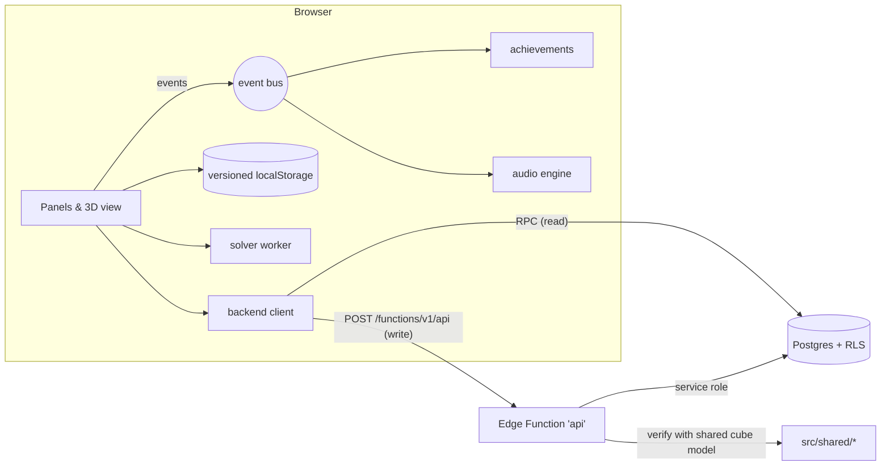

# Sixfold architecture

Sixfold is a static front end, hosted on GitHub Pages, backed by a small Supabase back end: Postgres, one Edge Function and read-only RPCs. The front end works fully offline. The back end adds the parts that need other people: the global daily leaderboard, challenge links, and player names.

## Principles
- **One source of truth for cube logic.** The sticker model (`state.js`), the daily scramble (`shared/daily.js`) and solve verification (`shared/verify.js`) are pure ES modules. The browser, the Node tests and the Edge Function all run the same code. `npm run sync:shared` copies them into `supabase/functions/_shared/`, and a test fails if the copies drift.
- **Never trust the client.** Clients can't write to any table. Every write goes through the Edge Function, which replays the submitted moves on the scramble and rejects anything that doesn't end solved. It also rejects timestamps that go backwards and impossible speeds (more than 20 turns per second, or under a second overall). The client can't choose the daily scramble either: the server derives it from the day number.
- **Least privilege.** Row-level security is enabled on every table, and there are no client policies at all. Reads go through `SECURITY DEFINER` RPCs that return only public columns: display names and times, never keys.
- **Guest identity without accounts.** Each device makes a random 256-bit key once. The server stores only its SHA-256, which identifies the player for names, leaderboard rows and rate limits. Nobody has to create an account, and nothing secret is stored server-side.
- **Offline first, degrade gracefully.** If the back end can't be reached, challenge links fall back to a self-contained compressed URL, the leaderboard says it's offline, and everything else carries on.
- **Loose coupling on the client.** Features like achievements, audio and the coach subscribe to a small event bus (`core/events.js`) instead of being wired into `main.js`, so adding a feature doesn't mean editing the core.
- **Versioned local data.** `core/storage.js` keeps a schema version and runs migrations, so stored data can change shape safely.

## Back end
| Object | Purpose |
|---|---|
| `players(id, key_hash, name)` | Guest identity. `key_hash` is unique; the name is 1–24 printable characters |
| `daily_results(day, player_id, ms, moves)` | One row per player per day, keeping their best time |
| `challenges(id, player_id, puzzle, scramble, start, moves, ms)` | Recorded solves that friends can race. Ids are 8-character random base62 |
| `rate_events(player_id, kind, at)` | Sliding-window rate limits: 60 submissions per hour per kind |
| `daily_leaderboard(day, lim)` (RPC) | Top N for a day: rank, name, time, moves |
| `daily_rank(day, player)` (RPC) | One player's rank and the total number of players that day |
| `get_challenge(id)` (RPC) | A challenge's public replay data |
| Edge Function `api` | `hello` (register / rename), `daily` (verify + upsert best), `challenge` (verify + store, returns id) |

Migrations live in `supabase/migrations/` and the function in `supabase/functions/api/`. Both are version-controlled.

## Front end
| Module | Role |
|---|---|
| `main.js` | Composition root: wires modules together; holds cube state and history |
| `core/events.js` | Typed event bus (`move`, `solved`, `solve`, `lesson`, `pattern`, …) |
| `core/storage.js` | Versioned localStorage with migrations |
| `services/backend.js` | Guest identity, RPC reads, function writes, timeouts, offline detection |
| `audio.js` | Click, musical turns and chime, all through one master bus (also recorded into videos) |
| `features/*` | Achievements, command palette, leaderboard, challenge links; each self-contained |
| `timer.js`, `learn.js`, `train.js`, … | Existing domain modules |
